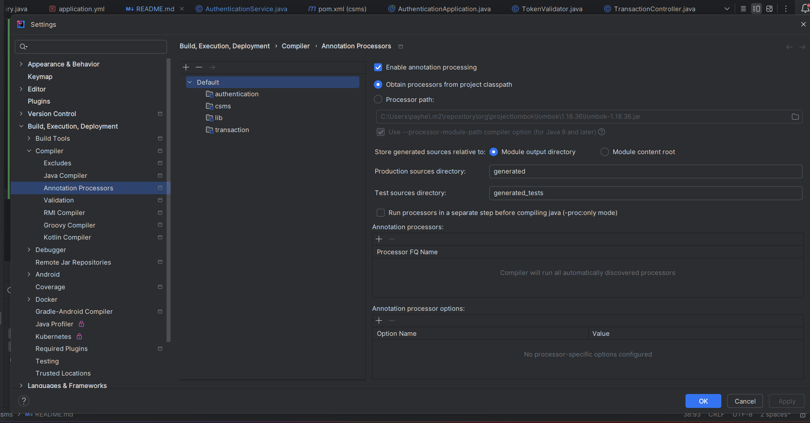

# Charging Station Management System (ChargePoint Coding Challenge)

## Intro
This project is a multi-module maven project that is has one parent maven project and three child maven projects.
They were generated through the Spring initializer for Java 21 with dev tools and Spring Web as dependencies. 
In production, all modules would be a separate standalone maven projects. 

### Modules

- chargepoint (parent maven project)
    - authentication (child maven project) (Spring Boot App)
    - transaction (child maven project) (Spring Boot App)
    - lib (child maven project) (contains common dtos)

## Setup

### Requirements
- Java 21
- Maven 4.x
- Docker
- IntelliJ IDEA

### How to run

In order to be able to run the projects properly the following actions must be taken step by step:

1. Then run following command from your project to run the necessary Zookeeper, Kafka and Mysql Docker containers.

    ````shell script
    $ docker compose up
    ````
2. After making sure that all containers are running without an issue, run the following command from the roots 
of `transaction` and `authentication` modules.

    ````shell script
    $ mvn spring-boot:run
    ````
   
<b>IMPORTANT</b>: In case the lombok dependency is not loaded for sub-modules make sure the 
`Settings -> Annotation Processing` is as following:



3. In the project root you'll find request samples to execute as a Postman collection `chargepoint.postman_collection` .
